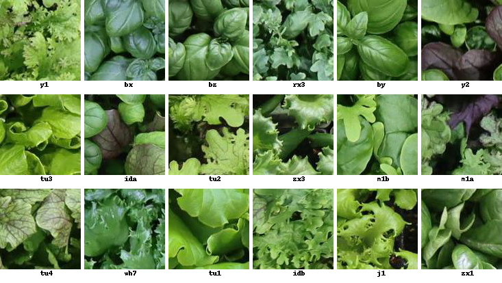

# Plant classification on the AGM and AGM<sub>HS</sub> dataset

This repository contains the official codebase for the research paper titled "A new large dataset and a transfer learning methodology for plant phenotyping in Vertical Farms" 
## Introduction

This codebase accompanies the research work conducted on the AGM and AGM<sub>HS</sub> dataset.



## Installation

To install and set up the project, follow these steps:

1. Clone this repository using Git:

```shell
git clone https://github.com/deepplants/agm-plant-classification.git
cd agm-plant-classification
```
2. Please install 
- [PyTorch](https://pytorch.org/get-started/locally/) 
- [datasets\[vision\]](https://huggingface.co/docs/datasets/installation) 
- [timm](https://pypi.org/project/timm/)
- [scikit-learn](https://scikit-learn.org/stable/install.html)
- [omegaconf](https://pypi.org/project/omegaconf/)

This codebase has been developed with python version 3.10, PyTorch version 2.0.1, CUDA 11.7 and torchvision 0.15.2.

3. Download the necessary datasets (cassava, riceplant, or plantdoc) as mentioned in the Usage section for fine-tuning.

4. Download our pretrained models on the AGM dataset:
| Model           | Augmentation           | Training Acc. | Val Acc. |
|------------------|----------------------|----------------|----------|
| [ViT base8](https://drive.google.com/file/d/17llNvslEptPDuJ2dd9utZERknNm9Sq_p/view?usp=sharing)       | Randaug Mixup         | 0.995          | 0.970    |
| [ViT small8](https://drive.google.com/file/d/1B5OmwA4kAh87N_BJifj6QkvwfztuKhA2/view?usp=sharing)      | Randaug Mixup         | 0.970          | 0.962    |
| [ViT small8](https://drive.google.com/file/d/1dkDUInmXb143UOPQCAY6GOj-bDfjxPkY/view?usp=sharing)      | Rotations & Flippings | 0.995          | 0.972    |
| [ViT small8](https://drive.google.com/file/d/16YlTdt3IBYvGEJh15dWenvPURNdAbe5n/view?usp=sharing)      | None                   | 0.996          | 0.968    |
| [ResNet50](https://drive.google.com/file/d/1bc-XTZYCyxvlOlz4_quvioGvil80P4AE/view?usp=sharing)        | Randaug Mixup         | 0.951          | 0.914    |

and specify their location in the config file.

## Usage
You can use this codebase to pretrain a VIT model on AGM or fine-tune a pretrained model on other datasets such as cassava, riceplant, or plantdoc or AGM<sub>HS</sub>. Here are some examples:

To pretrain a VIT model on AGM, run:
```shell
python pretrain.py --cfg configs/pretrain_config_base.yaml
```
To fine-tune a pretrained model on cassava, run:
```shell
python fine_tune.py --cfg configs/fine_tune_config_agm_hs.yaml
```
## Configurations

Our project provides pre-configured settings in the `configs` folder. You can customize these parameters to tailor the project to your specific requirements. Many of these settings are conveniently pre-configured, ready for use without additional modifications.

## License
This project is licensed under the MIT License.

## Contact
For any questions or inquiries, please contact 
- nico@deepplants.com
- etienne.david@agricolamoderna.com

## Citation

If you use this code or the AGM dataset in your work, please consider citing our paper.
